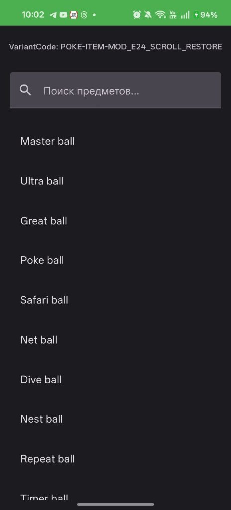
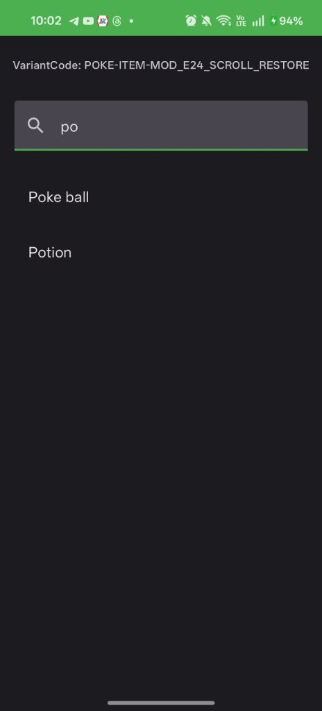
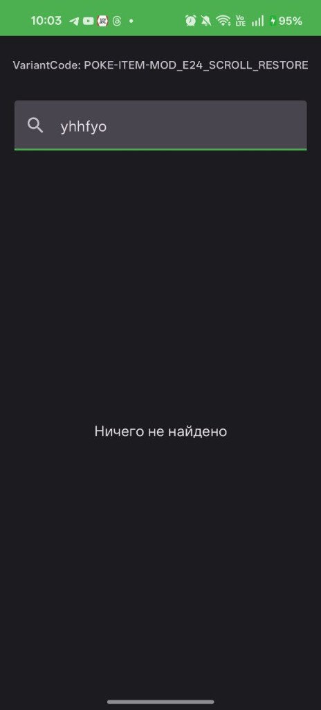
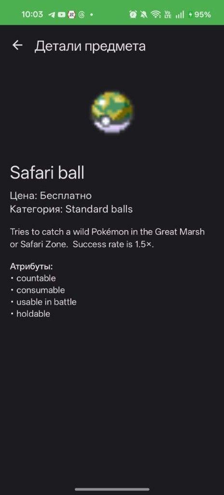
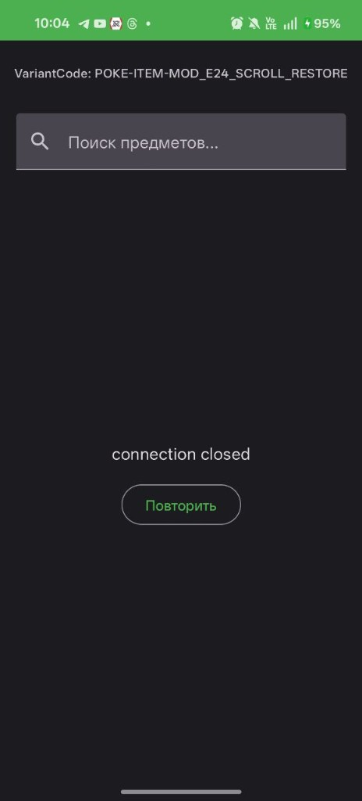

# Приложение PokeItem (Android)
VariantCode: POKE-ITEM-MOD_E24_SCROLL_RESTORE

## Описание
Android-приложение для просмотра предметов из PokéAPI v2 (ресурс ITEM).
Модификатор: MOD_E24_SCROLL_RESTORE — Search - Detail - Back сохраняет позицию списка (restore scroll state).

## Стек и архитектура
- Kotlin + Jetpack Compose + Coroutines
- Retrofit + OkHttp
- DI: Hilt
- Архитектура: data (DTO) - domain/UI model - Repository – ViewModel

## API (PokéAPI v2)
- Base URL: https://pokeapi.co/api/v2/
- List: GET /item?limit=20&offset=0
- Detail: GET /item/{id_or_name}/

## Модификатор - MOD_E24_SCROLL_RESTORE
Позиция списка сохраняется и восстанавливается при возврате с экрана деталей.
Поиск — локальная фильтрация по уже загруженному списку.

## Сборка (JDK 17)
Windows: gradlew.bat assembleDebug

## Скриншоты

